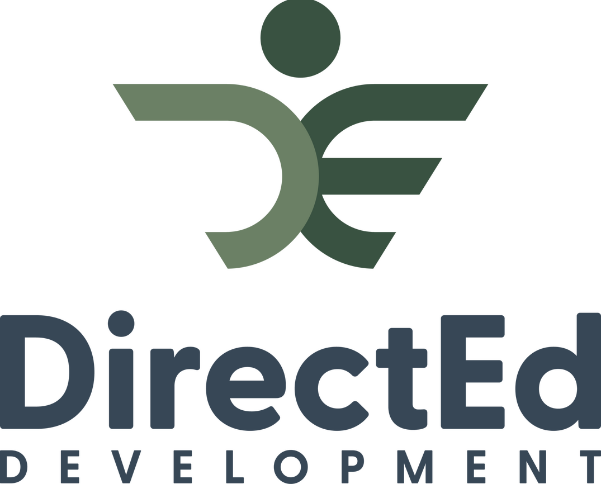

<a name="readme-top"></a>

<div align="center">
    
  <h1><b>Student Data Management Frontend</b></h1>
</div>

<!-- TABLE OF CONTENTS -->

# 📗 Table of Contents

- [📖 About the Project](#about-project)
  - [🛠 Built With](#built-with)
    - [Tech Stack](#tech-stack)
    - [Key Features](#key-features)
- [💻 Getting Started](#getting-started)
  - [Setup](#setup)
  - [Prerequisites](#prerequisites)
  - [Usage](#usage)
- [🚀Live Demo](#livedemo)
- [👥 Authors](#authors)
- [🔭 Future Features](#future-features)
- [🤝 Contributing](#contributing)
- [⭐️ Show your support](#support)
- [🙏 Acknowledgements](#acknowledgements)
- [📝 License](#license)

# 📖 Student Data Management Frontend <a name="about-project"></a>

**Student-Data-Management-Frontend** Our frontend repository offers a sleek interface for managing student data. Built with React.js, Redux, NextJS, and Typescript, it provides seamless interaction with features like survey responses, attendance tracking, and exam analysis.


### This is the [Link to the Backend repository](https://github.com/chiztechnology/Student-Data-Management-Backend) of this project

## 🛠 Built With <a name="built-with"></a>

### Tech Stack <a name="tech-stack"></a>

This project was implemented using:

<details>
  <summary>Client</summary>
  <ul>
    <li><a href="https://reactjs.org/">React.js</a></li>
  </ul>
</details>

<details>
  <summary>Server</summary>
  <ul>
    <li><a href="https://nodejs.org/">Node JS</a></li>
  </ul>
</details>

<details>
<summary>Database</summary>
  <ul>
    <li><a href="https://www.mysql.com/">Mysql</a></li>
  </ul>
</details>

### Key Features <a name="key-features"></a>

- **Student records (CRUD)**
- **Test & Attendance records (CRUD)**
- **Data importation from .CSV & .XLS files**
- **Data Exportation**

<p align="right">(<a href="#readme-top">back to top</a>)</p>

## 💻 Getting Started <a name="getting-started"></a>

To get a local copy up and running, follow these steps:

### Prerequisites

In order to run this project you need to have installed:

- [ ] You’ll need to have Nodejs on your machine.

Optionally, in order to modify this project you should to have installed:

- [ ] Git.

- [ ] Code editor like: [Visual Studio code](https://code.visualstudio.com/), or others...

### Setup

To clone this repository to your desired folder:

```console
git clone https://github.com/chiztechnology/Student-Data-Management-Frontend.git
```

- Access the cloned directory with:

```console
cd Student-Data-Management-Frontend
```

- Open it with your favorite code editor.

### Usage


In order to launch the app, it's mandatory to install the node dependencies then run the project

first install the dependencies
```console
npm install
```

then run the development server:

```bash
npm run dev
# or
yarn dev
# or
pnpm dev
# or
bun dev
```

Open [http://localhost:3000](http://localhost:3000) with your browser to see the result.


<p align="right">(<a href="#readme-top">back to top</a>)</p>

## 🚀Live Demo <a name="livedemo"></a>

Watch the video presentation of this app [by clicking on this link](https://www.loom.com/share/c2f144bf10154878a64aceefe1105b3e)

<p align="right">(<a href="#readme-top">back to top</a>)</p>

## 👥 Author <a name="authors"></a>

👤 **Israel CHIZUNGU**

- GitHub: [chiztechnology](https://github.com/chiztechnology)
- Twitter: [IsraelChizungu](https://twitter.com/IsraelChizungu)
- LinkedIn: [IsraelChizungu](https://www.linkedin.com/in/israelchizungu/)
- Portfolio: [IsraelCH](http://www.israel-portfolio.onrender.com)

<p align="right">(<a href="#readme-top">back to top</a>)</p>

## 🔭 Future Features <a name="future-features"></a>

We will implement this on the future:

- [ ] **Authentication**

<p align="right">(<a href="#readme-top">back to top</a>)</p>

## 🤝 Contributing <a name="contributing"></a>

Contributions, issues, and feature requests are welcome!

Feel free to check the [issues page](https://github.com/chiztechnology/Student-Data-Management-Frontend/issues).

<p align="right">(<a href="#readme-top">back to top</a>)</p>

## ⭐️ Show your support <a name="support"></a>

Give a ⭐️ if you like this project!

<p align="right">(<a href="#readme-top">back to top</a>)</p>

## 🙏 Acknowledgments <a name="acknowledgements"></a>

For everybody whose code was helpfull

<p align="right">(<a href="#readme-top">back to top</a>)</p>

## 📝 License <a name="license"></a>

This project is [MIT](./LICENSE) licensed.

<p align="right">(<a href="#readme-top">back to top</a>)

